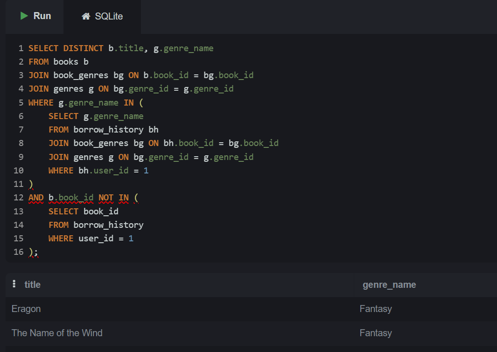
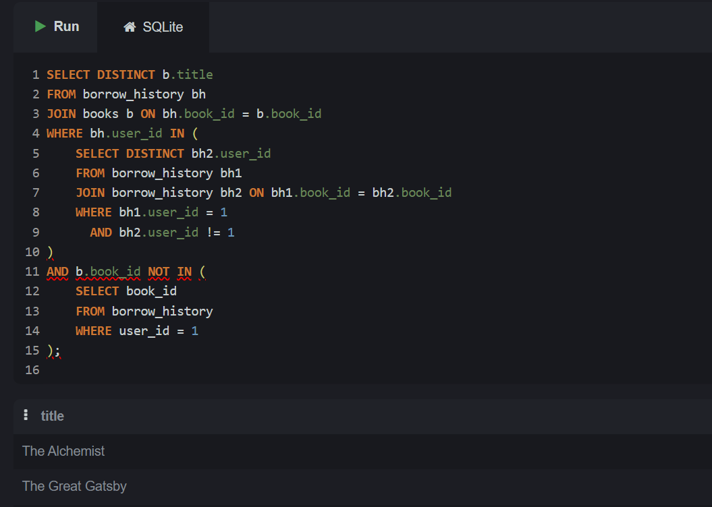
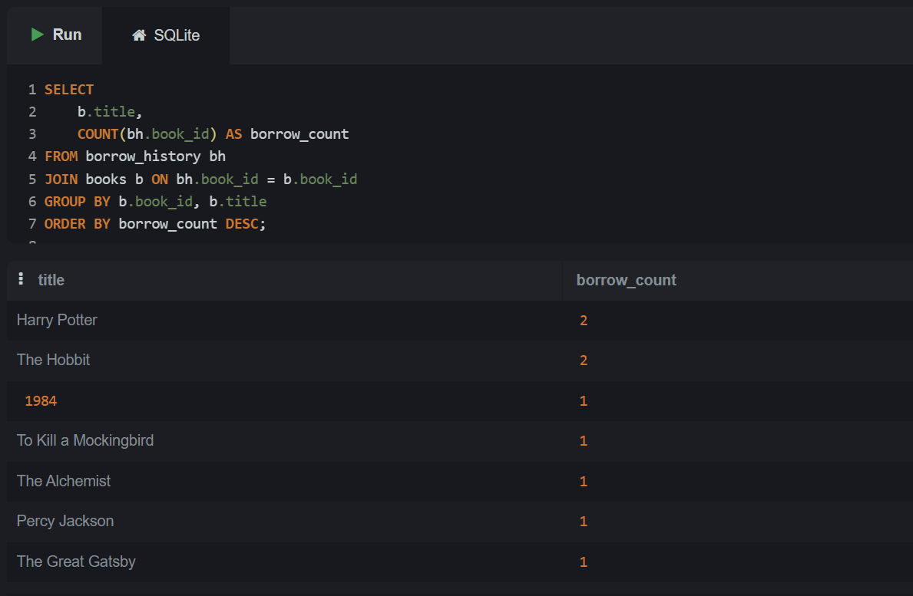

Library Recommendation System using SQL

This project is a Library Recommendation System developed entirely using SQL.
The goal of this project is to show how personalized recommendations can be created using only relational database logic—without relying on machine learning or external programming languages.
The system analyzes user behavior, reading patterns, and relationships between users and books to suggest relevant recommendations.

Recommendation Strategies Used:

1.Content-Based Filtering (Genre-Based)
Recommends books based on the genres a user reads most.

2.Collaborative Filtering (Similar-User Based)
Recommends books that similar users have read but the current user has not.

3.Popularity-Based Recommendation
Suggests trending books based on borrowing frequency and average ratings.

Database Schema
Tables used:

users – Stores user information
books – Stores book information
genres – Stores genre categories
book_genres – Many-to-many mapping of books and genres
borrow_history – Tracks user-book interactions
ratings – Stores user ratings on a scale of 1-5

How to Run:
Run schema.sql to create the database and tables.
Run sample_data.sql to insert demo data.
Run queries from the queries/ folder to generate recommendations.

Example Queries:
Genre-based: queries/genre_based_recommendation.sql
Similar-user: queries/similar_user_recommendation.sql
Popularity-based: queries/popular_books_recommendation.sql

Tech Stack:
MySQL
SQL
Git & GitHub

Key Concepts :
Joins
Subqueries
Grouping and aggregation
Filtering logic
Many-to-many relationships
Normalization
Ranking logic

Sample Outputs:
### Genre-Based Recommendation

### Similar-User Recommendation

### Popularity-Based Recommendation
